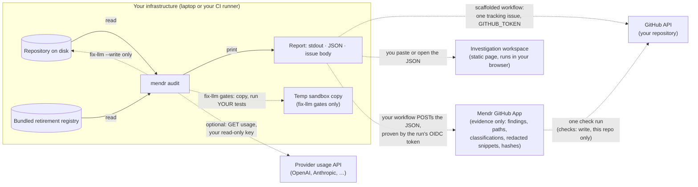

# Trust: what leaves your infrastructure, and how that is enforced

Mendr reads a repository and reports which AI model references are retiring.
That job needs the repository and nothing else, so the design rule is simple:
**the repository never leaves the machine that runs the scan, and the default
audit makes no network calls at all.** This document says exactly what each
command reads, writes and sends, how the "no network" claim is enforced in code
rather than in copy, what the threat model is, which permissions each surface
needs, and where the known gaps are.

Status: current for `v0.4.3-alpha` and `main`. Anything marked *planned* does not
exist yet and is listed so the boundary is stated before it is built.

---

## 1. Summary

| Claim | Enforced how |
|---|---|
| The default `mendr audit` makes zero outbound network calls. | The test suite runs the audit under a Node preload that makes every network primitive throw (`scripts/no-network.cjs`, `src/audit/noNetwork.test.ts`). The audit must still exit 0 with a valid report on every build. A control test proves the preload bites. |
| You can enforce it yourself. | `mendr audit . --offline` or `MENDR_OFFLINE=1` installs the same guard inside the process. Any attempt to open a socket, resolve a name or call `fetch` fails loudly and names the operation. |
| Mendr has no backend, no account, no telemetry. | There is nothing to send to. The only outbound call in the source is the optional provider usage read (section 3), which goes to the provider you name, with a key you supply, from your machine. |
| The GitHub App cannot read your code. | Its manifest requests `checks: write` and `metadata: read` only. It accepts one document (`mendr audit --json`), re-redacts every string and re-caps every snippet server-side, and stores nothing else. The one optional addition is `actions: write`, which lets it *start* your migration workflow the moment you approve a migration — still no contents, no clone, no file reads. Tested against a GitHub-shaped fake in `app/src/app.test.ts`. |
| Nothing edits your files unless you ask. | `fix-llm` prints a diff by default; `--write` is an explicit flag. `audit` never writes source. `--install` writes one workflow file you can read before committing. |
| Secrets do not leak through Mendr's own output. | Everything that could be published (the GitHub issue body, JSON snippets) passes through the same redaction (section 6). This is best-effort pattern matching and section 8 says what it does not cover. |

---

## 2. What each command reads, writes and sends

| Command | Reads | Writes | Network |
|---|---|---|---|
| `mendr audit [path]` | Source files under `path` (TS/TSX/JS/Python, config formats, `.gitignore`), the bundled registry, `git rev-parse HEAD` via the local git binary. | stdout/stderr only. | **None.** |
| `mendr audit [path] --refresh-registry` (or `MENDR_REGISTRY_REFRESH=on`, which the generated workflows set) | Same, plus the latest registry snapshot. | Same. | **One outbound HTTPS GET of three public files** — `manifest.json`, `manifest.sig`, `llm-deprecations.json` — from `github.com/ajitheee/mendr/releases/download/registry-latest/` (or `MENDR_REGISTRY_URL`). It sends nothing: no body, no header of yours, nothing about the repository. The snapshot is used only if its Ed25519 signature verifies against a key built into the release, its sha256 matches, and it is not older than the bundled copy; otherwise the bundled registry is used and the reason is disclosed. `--offline` wins. See [REGISTRY-FRESHNESS.md](REGISTRY-FRESHNESS.md). |
| `mendr audit [path] --json` | Same. Adds a ±3-line, 160-character snippet around each reported line and a 16-hex-character SHA-256 prefix of the reported line. | stdout only. | **None.** |
| `mendr audit [path] --issue-body <file>` | Same. | The Markdown issue body to the file you name. | **None.** |
| `mendr audit [path] --install` | Same. | One workflow file at `.github/workflows/mendr-audit.yml`. | **None.** |
| `mendr audit <path> <provider>` with a read-only key | Same, plus the provider's usage endpoint. | stdout, and `.mendr/exposure.json` in the repository. | **One outbound HTTPS GET to the provider you named** (OpenAI, Anthropic, Google, and so on), sent with the key you supplied from `MENDR_PROVIDER_KEY` or a flag. The key is never written to disk by Mendr and never sent anywhere else. Errors from the provider are redacted before printing. |
| `mendr audit https://github.com/org/repo` | The clone. | A shallow clone (`--depth 1`) into a temporary directory. | **One `git clone` to GitHub** using your local git and its credentials. Deleted after the run. |
| `mendr fix-llm <path>` | Source under `path`, the registry. | stdout diff. With `-o`, a diff file. With `--write`, the patched files, atomically. | **None from Mendr.** See the next row. |
| `mendr fix-llm <path> --eval-command "<cmd>"` and the test gate | Same. Copies the repository into a temp sandbox (excludes `node_modules`, `.git`, `dist`; `node_modules` is junctioned, not copied) and runs **your** test or eval command there with `execa`. | Whatever your command writes, inside the sandbox. | **Whatever your command does.** This is your test suite running under your environment. Mendr does not add network calls, and `--offline` cannot remove any that your suite makes. |
| `mendr migrate [path]` | Source under `path` and the registry. Copies the repo into temp sandboxes (same exclusions/junction as above) to run **your** `build` script, **your** test command, and an optional `--eval-command`, once without the change and once with it. | stdout (report or `mendr-migration/v1` JSON); with `--patch`, a patch file. **Never the working tree.** Sandbox writes stay inside the throwaway copy. | **Whatever your build/test/eval commands do** — the same boundary as the fix-llm gates. Mendr adds no network of its own. |
| `mendr verify-registry`, `registry-discover` (maintainer commands) | The registry files in this repository. | Registry files, a PR in this repository. | Provider documentation pages and model-list endpoints. These run in Mendr's own CI against Mendr's own repository, never against yours. |
| Scaffolded audit workflow (`--install`) | Your repository at the checked-out SHA, inside your GitHub Actions runner. | One tracking issue in your repository (created, updated, closed), nothing else. | The Node download from `npm`/GitHub to install Mendr, and the GitHub API calls the workflow makes to your own repository with `GITHUB_TOKEN`. The scan itself makes none. |
| `mendr-action` (fix PRs) | Same. | A branch and a pull request in your repository containing the gated diff. | Same as above. Plus — only when you set `app-url` and grant `id-token: write` — **one POST of the migration result to your Mendr App** (outcome, PR url, verdict, gate statuses, the swaps and the file paths they touch; **never the diff**), proven by the run's OIDC token. A failed POST is a warning, never a failed job. With `approval-gated`, also to your App: one GET (what a person approved), one POST (claim it) and one short POST per stage of progress (a stage name and a redacted line such as the files a swap touches or a PR number — never code). |
| Mendr GitHub App (`app/`, hosted by Mendr) | The JSON your workflow posts and the claims of the run's OIDC token. Installation webhooks from GitHub. | Installations, repository ids and names, and the sanitized evidence per run in its Postgres. One check run on the commit. | Inbound from GitHub (webhooks) and from your CI (the POST). Outbound only to the GitHub API: an installation token limited to that repository and `checks: write`, the check run, and the signed-in user's repository access for the read side. |

The audit **never** sends: file contents, file names, model ids, findings,
paths, hashes, the repository URL, your git identity, environment variables,
or usage statistics. There is no endpoint for them to go to.

---

## 3. The network surface, audited

Every place in the shipped source that can reach the network, with why it exists.

| Where | What | When it runs |
|---|---|---|
| `src/recon/providers.ts` (`getJson`) | One of the two `fetch` call sites in the package (the other is the registry refresh below). `GET` to the named provider's usage endpoint, 30-second timeout, `Authorization` header from the key you passed. | Only when you name a provider and supply a key. |
| `src/cli.ts` (`cloneRemoteOrExit`) | `git clone --depth 1` via `simple-git`, using your local git. | Only when the path argument is a GitHub URL. |
| `src/registry/freshRegistry.ts` (`getBytes`) | The other `fetch`: `GET` of the three public registry-snapshot files, 10-second timeout per file, 8 MB cap, no header or body of yours. Verified before use — signature against a key built into the release, schema version, sha256, rollback floor, then the same entry validation as the bundled file — and any failure falls back to the bundled registry with the reason disclosed. | Only with `--refresh-registry` / `MENDR_REGISTRY_REFRESH=on`; never under `--offline`; never when the build trusts no signing key. |
| `src/gates/runTests.ts`, `src/gates/runEval.ts` | `execa` runs the repository's own `npm test` or the `--eval-command` you pass, inside the sandbox copy. | Only in `fix-llm` gates. This is your code's network activity, not Mendr's. |
| `scripts/` (registry maintenance) | Provider docs and model-list fetches. | Mendr's own CI on Mendr's own repository. Not part of the audit and not run in yours. |
| `mendr-action/scripts/run-mendr.sh` (`report_to_app`) | `curl` of the run's OIDC token from GitHub, then one `POST` of the migration result (built by `build-report.mjs` from a field whitelist — the diff is never in it) to the `app-url` you set. | Only in `mendr-action`, only when `app-url` is set and the job grants `id-token: write`; in your CI. Otherwise nothing is sent. |

Nothing else opens a socket. The runtime dependencies are `commander`,
`diff`, `execa`, `simple-git`, `ts-morph` and `web-tree-sitter`; none of them
phones home, and the offline test would fail if any started to.

How to check this yourself on any build:

```bash
NODE_OPTIONS="--require ./node_modules/mendr/scripts/no-network.cjs" npx mendr audit . --json
```

or, without the preload, `npx mendr audit . --offline`. Either way the audit
completes; a network attempt would abort the run with the operation named.

---

## 4. Data flow



Solid arrows are the default audit. Dotted arrows only happen when you ask for
them. There is no Mendr server on this diagram because there is none.

**What the JSON contains, precisely.** For each finding: provider, model id,
file path, line number, evidence type, tier, disposition (`patch` /
`review` / `informational`), the reason, the registry dates, a ±3-line
snippet clipped to 160 characters per line, and a 16-character SHA-256 prefix of
the trimmed reported line. The snippet is redacted (section 6). The hash lets a
UI tell "same line, unchanged" from "line changed" without holding the line.
The JSON contains no other file content.

**The GitHub App (built, `app/`).** The scanner still runs inside your GitHub
Actions. Your workflow posts **only the JSON described above** to the App,
authenticated by the run's GitHub OIDC token, so nothing in your repository
holds a secret and the App knows exactly which repository, commit and run the
evidence came from. The App re-redacts and re-caps the document before storing
it, writes one check run on the commit, and shows the evidence only to users
GitHub confirms can access that repository. It does not clone your repository
into a Mendr backend and cannot: it holds no `contents` permission. A GitHub App
with read-only access would not be the same thing: read-only means we cannot
modify your repository, not that we cannot read or store your code. Mendr's
boundary is that the code is read only where it already lives, by a process
you run.

### What the App stores (data inventory)

The App's database has six data tables plus an audit log, and nothing else.
Every field below is used; none is speculative. Two things are deliberately
**absent**, and that absence is the point: **no access tokens or credentials of
any kind, and no source code**.

**`installations`** — one row per GitHub account that installed the App (the
tenant boundary).

| Field | What | Sensitivity | Why it is kept |
|---|---|---|---|
| `id` | GitHub installation id | low (opaque id) | the tenant key |
| `account_login`, `account_type` | the org/user name and kind | low (public) | display, and org vs user |
| `suspended`, `deleted_at`, timestamps | lifecycle | low | to stop accepting evidence when access is gone |

**`repos`** — one row per repository the installation covers.

| Field | What | Sensitivity | Why it is kept |
|---|---|---|---|
| `id` | GitHub repo id | low | routing key |
| `full_name` | `owner/name` | low–medium (a private repo's *name*, not its contents) | routing and display |
| `private` | is the repo private | low | display |
| `removed_at` | when access was removed | low | lifecycle |

**`runs`** — one row per audit result a CI run sent.

| Field | What | Sensitivity | Why it is kept |
|---|---|---|---|
| `sha`, `ref`, `run_id`, `run_attempt`, `workflow_ref` | which commit/run produced it | low | identify the run, dedupe attempts |
| `actor` | the GitHub login that triggered the run | low–medium (a username) | shown on the run page; not required for function |
| `received_at`, `generated_at`, `conclusion`, `patch`/`review`/`informational` | when, and the headline result | low | listing and the check run |
| `report` (JSONB) | the sanitized `mendr-audit/v3` document: findings, **file paths, line numbers**, classifications, **redacted ≤7-line snippets**, line hashes | **medium** — paths and short code fragments, already secret-redacted; never whole files | render the finding page and the check-run annotations |
| `check_run_url` | link to the GitHub check | low | convenience |

**`migrations`** — one row per result `mendr-action` reported after a migration
run (only when the workflow sets `app-url`).

| Field | What | Sensitivity | Why it is kept |
|---|---|---|---|
| `sha`, `ref`, `run_id`, `run_attempt`, `workflow_ref`, `actor` | which commit/run produced it | low | identify the run, dedupe attempts |
| `received_at`, `generated_at`, `outcome`, `verdict`, `pr_url` | when, what happened (`clean` / `migration-proposed` / `not-verified` / `error`), the sandbox verdict, the PR | low | the finding page's "PR #12 · verified" line |
| `report` (JSONB) | the whitelisted `mendr-migration-report/v1`: the four gate statuses, the model swaps (`from` → `to`, provider, language, site count) and the **file paths** they touch, capped notes | **medium** — file paths; **never the diff**, which the action strips and the App strips again | render the migration status and confirm a resolution against the next audit |

**`acknowledgements`** — one row per acknowledgement of a finding by a
signed-in person: "seen; X owns it". Keyed by repository + provider + model so
it follows the finding across runs; clearing keeps the row as history. An
acknowledgement never changes a finding's status — only a completed scan on a
fresh registry can — and the App writes nothing to GitHub for it.

| Field | What | Sensitivity | Why it is kept |
|---|---|---|---|
| `provider`, `model` | which finding it is about | low (a model name) | the key that follows the finding across runs |
| `acknowledged_by`, `cleared_by` | the GitHub logins that acknowledged / cleared — taken from the session, never from the form | low–medium (usernames) | the record *is* the feature: who has seen it |
| `owner` | who owns the follow-up — a login, a team or a name, as typed | low–medium (free text, ≤ 80 chars, escaped on render) | shown on the finding |
| `note` | a short note, as typed | **medium** — free text a person chose to write (≤ 400 chars, escaped on render); kept out of the audit log | shown on the finding |
| `created_at`, `cleared_at` | lifecycle | low | at most one active row per finding |

**`approvals`** — one row per decision, made in the App, to migrate one
finding. The App records it; the repository's own migration workflow asks for
it (proven by its OIDC token), claims it, carries it out in the customer's CI
and streams its progress back. The App never touches the repository: with the
optional `actions: write` it may *start* that workflow, and that is all.

| Field | What | Sensitivity | Why it is kept |
|---|---|---|---|
| `provider`, `model`, `replacement` | which finding, and the registry's recommended replacement at the time | low (model names) | what exactly was approved |
| `mode` | `pr` (open a pull request for review) or `auto-merge` (also enable GitHub's auto-merge on it) | low | the CI honours it |
| `approved_by` | the GitHub login that approved — from the session, never the form | low–medium (a username) | the record *is* the decision |
| `status`, `created_at`, `dispatched_at`, `started_at`, `finished_at`, `run_id`, `migration_id`, `outcome` | queued → running → done / failed, or cancelled; which CI run took it and which report closed it | low | the finding shows where it stands |
| `events` (JSONB) | the progress timeline the CI run streamed: a stage, a time and a short line (which files a swap touches, a PR number) | low–medium — file paths; every line is redacted and capped, and it is **never code** | the live status on the finding |

**`audit_log`** — an append-only record of security-relevant events (section
5c): `event`, `installation_id`, `repo`, `actor`, and a `detail` object of
**scalars only** (counts, ids, a conclusion). A sanitizer drops any non-scalar
before it is written, so the audit log can never hold findings, secrets or code.

**Not stored, ever:**

- **User GitHub tokens** — held only inside the viewer's encrypted, HttpOnly
  session cookie; there is no session table and no user token at rest
  (`app/src/auth/session.ts`). A database dump contains no user credential.
- **Installation tokens** — minted on demand per API call, cached in memory
  with their short expiry, never written to the database
  (`app/src/github/api.ts`).
- **The App private key and client secret** — read from the environment, never
  stored in the database.
- **Source code** — only the redacted, capped snippets inside `report`; never a
  whole file, never a clone.

The sensitive fields are therefore the two `report` columns — `runs.report`
(paths + redacted snippets) and `migrations.report` (the paths a migration
touches). Both are the target of field-level encryption (below) and of
retention/deletion (section 5b). `actor` is the only field kept purely for display rather than
function, and can be dropped by a customer who wants no usernames retained.
`acknowledgements.owner` and `.note` are the only free text a person types
into the App: both are capped, escaped on render, and deleted with the
repository's data (on demand or on uninstall).

### Encryption at rest

Two layers, because one is not enough:

1. **Infrastructure encryption.** The Postgres deployment must have
   encryption-at-rest enabled (managed Postgres — RDS, Cloud SQL, Neon, Supabase
   — does this by default; a self-hosted instance needs an encrypted volume).
   This protects the disk, but not a leaked logical dump.
2. **Field-level encryption of `report`.** The one sensitive column is encrypted
   by the App before it is written, with a key that lives in the App environment
   (`MENDR_DATA_KEY`), never in the database. A stolen dump reveals installation
   ids, repo names and headline counts — but every finding's paths and snippets
   are AES-256-GCM ciphertext (`app/src/store/encryption.ts`). GCM is
   authenticated, so a tampered row fails to decrypt rather than returning
   forged findings.

**There are no stored credentials to encrypt.** User tokens live only in the
encrypted cookie; installation tokens are minted in memory; the App key is in
the environment. So field-level encryption covers the entire sensitive-data-at-
rest surface: the `report`.

**Key format and rotation.** `MENDR_DATA_KEY` is one or more comma-separated
`id:key` entries, each a 32-byte key in base64 or hex (a bare key gets id `k1`).
The **first** entry seals new writes; the rest exist so rows sealed under an
older key still decrypt. To rotate: generate a new key, prepend it as the new
primary, and keep the previous key in the list — new writes use the new key,
old rows keep opening under the old one, and no migration or re-encryption pass
is required. Drop a retired key from the list only once no row is still sealed
under it.

**Recovery.** The key is the only thing that can open stored reports; losing it
makes the `report` column unrecoverable (installation/repo metadata and counts
survive). Keep `MENDR_DATA_KEY` in the same secret manager as the App private
key, with the same backup and access controls, and never commit it. Without the
key set, the App stores reports in plaintext and warns loudly at boot — that is
a development-only mode.

### Retention, deletion and uninstall (section 5b)

Data leaves when access does:

- **Uninstall the App** → every finding and every repository row for that
  installation is **hard-deleted** immediately (the `installation.deleted`
  webhook). The installation row survives only as a deletion record — an id, a
  login, a `deleted_at` — holding no findings.
- **Remove a repository** from the installation → that repository's stored runs
  and its row are hard-deleted (`installation_repositories.removed`). Not a
  soft-delete that keeps the data around.
- **Delete on demand** → a signed-in user with access can delete a repository's
  stored findings at any time from its page (`POST /r/:owner/:name/delete`),
  without uninstalling.
- **Retention** → `MENDR_RETENTION_DAYS` deletes runs older than N days; run
  count per repository is always bounded by `MAX_RUNS_PER_REPO`. Set a short
  retention if you want findings to age out on their own.
- **Deletion is recorded, not the content.** Each deletion writes an audit-log
  line with the repository and the count removed (section 5c) — never the
  findings themselves.

There are no user or installation **tokens** to revoke on uninstall: user tokens
live only in the viewer's cookie (which the user clears by signing out), and
installation tokens are minted in memory and expire on their own; GitHub also
invalidates them the moment the App is uninstalled.

### Audit log (section 5c)

The App keeps an append-only `audit_log` of the security-relevant events, so an
operator can reconstruct what happened during an incident:

- installation connected, suspended, removed;
- repositories added or removed;
- an audit received (with its conclusion and counts);
- data deleted (self-service or on uninstall).

Two more events — a finding acknowledged, and a migration prepared / PR created
— are wired to record once those features land (acknowledgement tracking, and
the Action's PR flow reporting back).

Every entry stores only **scalars** — an event name, ids, a login, counts, a
conclusion — passed through a sanitizer that drops any object or array before it
is written. The audit log therefore **never contains findings, secrets or source
code**, by construction (`app/src/store/auditLog.ts`, enforced by tests). Reading
it is an operator action (direct query / admin tooling), not a customer-facing
page.

---

## 5. Threat model

### Assets

1. **Your source code.** The thing most customers will not let leave their
   network.
2. **Secrets committed near model references.** Keys in config files, `.env`
   files that escaped `.gitignore`, test fixtures with real tokens.
3. **Your provider keys** used for the optional usage read.
4. **Repository integrity.** Nobody should be able to change your default branch
   through Mendr.
5. **The audit verdict.** A forged "clean" or a forged "closed" hides a real
   retirement.
6. **Mendr's own supply chain.** The package you run and the registry it trusts.

### Trust boundaries

- Your machine or CI runner ↔ the public internet. The default audit does not
  cross it.
- Your repository ↔ Mendr's output. Repository contents are untrusted input;
  the report is the only output and is sanitized.
- Your repository ↔ the sandbox where `fix-llm` runs your tests. Same trust
  level as running your own test suite locally.
- Mendr ↔ the retirement registry. The registry is data shipped inside the
  package and maintained by Mendr's own CI in its own repository — and, on
  request, refreshed from a signed, dated snapshot that CI publishes. A snapshot
  is used only if it verifies against a key built into the release. Mendr never
  auto-adds registry entries from a customer scan.

### Threats and mitigations

| # | Threat | Mitigation | Residual |
|---|---|---|---|
| T1 | Repository contents exfiltrated by the scanner. | No backend, no telemetry, no `fetch` in the default audit path; enforced by the offline test on every build and by `--offline` at run time. The opt-in registry refresh is a `GET` of public files that carries nothing of yours (section 3). | The GitHub App receives only the JSON in section 4 and is tested to re-redact and re-cap it. It holds no `contents` permission, so it could not fetch code even if asked. |
| T2 | A committed secret published through the audit's own output (issue body, JSON snippet). | `redactSecrets` runs over the whole issue body and every snippet line before clipping. Snippets are ±3 lines and 160 chars, never whole files. | Pattern-based. An unusual secret format adjacent to a model line could survive. See section 8. |
| T3 | Your provider key leaked by the usage read. | Key read from env or flag, held in memory, sent only to the provider named, over HTTPS, 30-second timeout. Provider error bodies are redacted before printing. Never written to disk. | You choose the key's scope. Use a read-only or usage-only key. |
| T4 | Mendr modifies your default branch. | The scaffolded workflow runs with `contents: read` and `persist-credentials: false`. `fix-llm` never writes without `--write`; `mendr-action` writes to a branch and opens a PR, never pushes to the default branch. | `mendr-action` needs `contents: write` to push its branch. Branch protection on your side is the control. |
| T5 | A committed file path or string injects Markdown, HTML or a forged state marker into the tracking issue. | `sanitizeRepoText` strips `<`, `>`, `|`, backticks and newlines, caps at 400 chars; the state block is parsed from the last occurrence only, so an injected earlier block cannot shadow it. Tested in `issueReport.test.ts`. | None known. |
| T6 | A forged "clean" verdict or a wrongly closed issue. | The issue can only close when every required surface completed and no surface failed (`mayClose`). Partial coverage reports as inconclusive, never clean. Test files and unsupported languages are counted and shown. | Coverage is by file type; a model reference in an unsupported language is reported as unanalyzed, not found. |
| T7 | `fix-llm` runs untrusted code. | It runs **your** test command in a temp copy of **your** repository. This is the same code you run in CI already. | If your repository is untrusted to you, do not run its tests through any tool. |
| T8 | Malicious or tampered Mendr package. | Pin to a tag (`github:ajitheee/mendr#v0.4.3-alpha`) or, stricter, a commit SHA. Tags are annotated and never moved (see section 9). Dependencies are few and pinned in the lockfile. | Releases are not yet cryptographically signed and there is no SLSA provenance. Planned; stated honestly in section 9. |
| T9 | A poisoned registry entry makes Mendr recommend a wrong migration. | Registry changes go through PRs in Mendr's repository with a verify job; retirement dates are marked `UNVERIFIED` until confirmed and unverified dates are never rendered as overdue. Refreshed snapshots are Ed25519-signed by Mendr's CI and verified against a key built into the release, bound by sha256, refused if older than the bundled copy, and parsed through the same entry validation as the bundled file — a mirror or a network attacker cannot substitute a registry ([REGISTRY-FRESHNESS.md](REGISTRY-FRESHNESS.md)). | The registry is maintained by one team today. Independent review is a future control. |
| T10 | `--install` writes a workflow you did not read. | It writes one file, prints the path, and the file's comments explain each permission. Nothing runs until you commit it. | None. |
| T11 | A stale registry passes as current, so a newly announced retirement is missed while the scan still reads "no exposure". | Every registry in use is dated (a signed `publishedAt`, or the release stamp for the bundled copy) and graded by age; older than 14 days makes a zero-finding scan `inconclusive`, never clean, while exposure is still reported. The weekly publish re-stamps a verified registry; if that pipeline stops, results turn inconclusive rather than confident. | A retirement announced inside the window, or not yet in the registry, is invisible until the registry catches up. The report says only what the registry knew, and when. |

### Adversaries considered

A curious or careless Mendr maintainer (T1, T3: the design leaves nothing to be
curious about). A malicious contributor to a repository you scan (T2, T5, T7).
A network attacker between your CI and GitHub or a provider (HTTPS only; GitHub
token handling is GitHub's). A compromised upstream dependency (T8, offline test
catches new network behavior on the next build).

---

## 6. Secret redaction

Applied to the entire rendered issue body and to every JSON snippet line, before
clipping, so a truncated key cannot survive as a partial secret. Patterns:

- `sk-`, `pk-`, `rk-` prefixed keys (OpenAI, Stripe and lookalikes), 8+ chars
- GitHub tokens: `ghp_`, `gho_`, `ghu_`, `ghs_`, `ghr_` and `github_pat_`
- Slack tokens: `xoxb-`, `xoxa-`, `xoxp-`, `xoxr-`, `xoxs-`
- AWS access key ids: `AKIA` followed by 16 uppercase alphanumerics
- JSON Web Tokens (three base64url segments starting with `ey`)
- Any `NAME=value` or `NAME: value` where the name ends in `TOKEN`, `SECRET`,
  `PASSWORD`, `API_KEY`, `APIKEY`, `ACCESS_KEY`, `ACCESSKEY` or `CREDENTIAL(S)`,
  case-insensitive, value 6+ chars

Tested in `src/audit/issueReport.test.ts` and, for JSON snippets, in
`src/audit/auditStdout.test.ts`. What it does not catch is in section 8.

---

## 7. Permissions

### CLI, run locally

Needs read access to the repository and a writable temp directory. Needs write
access to the repository only for `fix-llm --write`, `--install`, `-o`,
`--issue-body` and `.mendr/exposure.json`, each of which you name explicitly.
Needs no credentials. The optional usage read needs a provider key of your
choosing; use a read-only or usage-scoped key.

### Scaffolded audit workflow (`mendr audit --install`)

```yaml
permissions:
  contents: read     # the default branch cannot be modified
  issues: write      # maintains the single tracking issue
```

`actions/checkout` runs with `persist-credentials: false`, so the token is not
left in the git config for later steps. The workflow comments recommend pinning
`actions/*` to commit SHAs. No `pull-requests: write`, no `id-token`, no secrets
beyond the automatic `GITHUB_TOKEN`.

### `mendr-action` (opens fix PRs)

```yaml
permissions:
  contents: write      # push the fix branch
  pull-requests: write # open the PR
```

It opens a PR. It never merges one itself; when an approval made in the App
asked for "merge when checks pass", it enables GitHub's own auto-merge on that
PR, which still obeys your branch protection and required checks. With
`approval-gated` it does nothing at all until a person has approved a specific
model in the App, and then migrates only that model. Use the read-only workflow
first if you do not want this.

### Mendr GitHub App (`app/`)

```yaml
default_permissions:
  checks: write     # write the audit result on the commit
  metadata: read    # mandatory for every GitHub App
default_events: []  # only the installation webhooks GitHub always sends
```

No `contents`, no `pull_requests`, no `issues`. Each check run is written with
an installation token limited to that one repository and `checks: write`. The
evidence endpoint accepts only the run's GitHub OIDC token (your workflow adds
`id-token: write`); there is no shared secret to store. In the scaffolded audit
workflow the upload step is commented out and `id-token: write` is not granted,
so a plain install sends nothing; enabling the App is a deliberate opt-in you
make in your own workflow, and only then does the job carry `id-token: write`. Sign-in uses the App's
OAuth flow and your token stays in an encrypted cookie, never in the database.
You can see a repository's evidence only if the App is installed on it and
GitHub confirms you can access it. If a scope is ever added, this section and
the changelog will say which and why.

**Approving a migration** happens in the App, on the finding; the work happens
in your CI. A second workflow file (`.github/workflows/mendr-migrate.yml`,
handed to you through GitHub's own editor exactly like the audit workflow — you
read it and commit it) runs `mendr-action` with `approval-gated` on a schedule:
it asks the App what a person approved, claims it, migrates only those models
with the permissions listed under *mendr-action* above (`contents: write` for
its one branch, `pull-requests: write` for its one PR), streams its progress and
reports the result — all proven by the run's OIDC token (section 2). The App's
own permissions do not change for any of this. One optional permission exists:
`actions: write`, which lets the App **start** that workflow the moment you
approve instead of waiting for its next scheduled check. It is not code access
— `actions: write` covers starting and cancelling workflow runs — and the App
requests it per call, scoped to the one repository, only when you click
Approve; without it nothing is lost, the schedule picks the approval up. The
App knows three things about the workflow: whether the file exists (the audit
reports `coverage.migration.workflowPresent`), when it last asked for approvals
(`repos.migrate_seen_at`), and what the action reported. A resolution is still
confirmed only when a later completed audit on a fresh registry no longer finds
the model — never from the PR or a merge event.

---

## 8. Known gaps, stated plainly

- **Redaction is pattern-based.** A secret in an unfamiliar format on a line
  within three lines of a model reference could appear in a JSON snippet or
  issue body. Do not run the audit with `--issue-body` against a repository you
  know contains live secrets; rotate any committed secret regardless of Mendr.
- **`--offline` does not govern your test suite.** `fix-llm` gates run your
  commands in a subprocess that inherits your environment, not the in-process
  guard.
- **Releases are unsigned.** Tags are annotated and immutable by policy, not
  by cryptography. See section 9.
- **The hosted App is the only evidence view.** It shows the run page (the
  five-part findings), migration results and the evidence JSON. The pre-App
  paste-JSON prototype that once lived at `/app` has been removed; its old URL on
  the marketing site redirects to the App.
- **Coverage is by language.** Model references in files Mendr cannot parse are
  counted as unanalyzed and reported as such. They are not silently clean.

---

## 9. Releases, provenance and dependencies

- **Distribution.** `npx github:ajitheee/mendr#<tag>`. Pin a tag, or a commit
  SHA for the strictest posture. The package `files` list ships only `dist`,
  `registries`, `wasm`, `README.md` and `LICENSE`.
- **Tags never move.** A published tag is frozen. Defects go into the next tag
  (`v0.2.3-alpha` was not modified when `v0.2.4-alpha` fixed what the partner
  audits found). Each release has a `RELEASE-<tag>.md` in the repository with
  the exact claim it makes and the corpus it was validated on.
- **Signing and provenance.** Registry snapshots are signed: `registry-publish`
  signs a canonical manifest (content hash, sha256, `publishedAt`, source
  commit) with an Ed25519 key held only as a CI secret, and scanners verify it
  against the public key built into the release (`src/registry/trustedKeys.ts`).
  Code releases are not yet signed. Planned in this order: signed annotated
  tags, then npm publication with provenance attestation, then a SLSA-style
  build statement from CI. Until then, verify a tag's commit SHA against the
  release notes.
- **Dependencies.** Six runtime dependencies for the CLI (section 3) and four
  for the App (`hono`, `@hono/node-server`, `jose`, `pg`), all pinned in
  lockfiles. CI installs with `npm ci`. Policy: a dependency that adds network
  behavior fails the offline test and is not merged; security advisories
  against a runtime dependency are addressed in the next tag, and the changelog
  names the advisory.
- **Registry updates** are data changes reviewed by PR in Mendr's repository.
  They are never generated from a customer's scan. Once merged and verified,
  they reach pinned scanners as a signed snapshot
  ([REGISTRY-FRESHNESS.md](REGISTRY-FRESHNESS.md)): the code stays pinned,
  only the data moves, and only signed.

---

## 10. Reporting a vulnerability

See [SECURITY.md](SECURITY.md). In short: use GitHub's private vulnerability
reporting on this repository, expect an acknowledgement within three business
days, and expect the fix to ship as a new tag with the advisory named in the
changelog.
