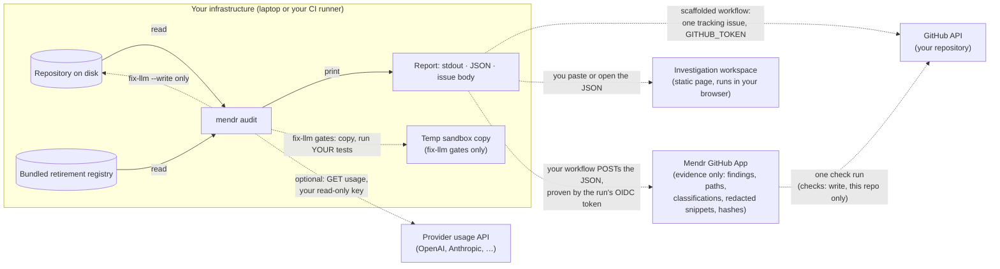

# Trust: what leaves your infrastructure, and how that is enforced

Mendr reads a repository and reports which AI model references are retiring.
That job needs the repository and nothing else, so the design rule is simple:
**the repository never leaves the machine that runs the scan, and the default
audit makes no network calls at all.** This document says exactly what each
command reads, writes and sends, how the "no network" claim is enforced in code
rather than in copy, what the threat model is, which permissions each surface
needs, and where the known gaps are.

Status: current for `v0.2.4-alpha` and `main`. Anything marked *planned* does not
exist yet and is listed so the boundary is stated before it is built.

---

## 1. Summary

| Claim | Enforced how |
|---|---|
| The default `mendr audit` makes zero outbound network calls. | The test suite runs the audit under a Node preload that makes every network primitive throw (`scripts/no-network.cjs`, `src/audit/noNetwork.test.ts`). The audit must still exit 0 with a valid report on every build. A control test proves the preload bites. |
| You can enforce it yourself. | `mendr audit . --offline` or `MENDR_OFFLINE=1` installs the same guard inside the process. Any attempt to open a socket, resolve a name or call `fetch` fails loudly and names the operation. |
| Mendr has no backend, no account, no telemetry. | There is nothing to send to. The only outbound call in the source is the optional provider usage read (section 3), which goes to the provider you name, with a key you supply, from your machine. |
| The GitHub App cannot read your code. | Its manifest requests `checks: write` and `metadata: read` only. It accepts one document (`mendr audit --json`), re-redacts every string and re-caps every snippet server-side, and stores nothing else. Tested against a GitHub-shaped fake in `app/src/app.test.ts`. |
| Nothing edits your files unless you ask. | `fix-llm` prints a diff by default; `--write` is an explicit flag. `audit` never writes source. `--install` writes one workflow file you can read before committing. |
| Secrets do not leak through Mendr's own output. | Everything that could be published (the GitHub issue body, JSON snippets) passes through the same redaction (section 6). This is best-effort pattern matching and section 8 says what it does not cover. |

---

## 2. What each command reads, writes and sends

| Command | Reads | Writes | Network |
|---|---|---|---|
| `mendr audit [path]` | Source files under `path` (TS/TSX/Python, config formats, `.gitignore`), the bundled registry, `git rev-parse HEAD` via the local git binary. | stdout/stderr only. | **None.** |
| `mendr audit [path] --json` | Same. Adds a ±3-line, 160-character snippet around each reported line and a 16-hex-character SHA-256 prefix of the reported line. | stdout only. | **None.** |
| `mendr audit [path] --issue-body <file>` | Same. | The Markdown issue body to the file you name. | **None.** |
| `mendr audit [path] --install` | Same. | One workflow file at `.github/workflows/mendr-audit.yml`. | **None.** |
| `mendr audit <path> <provider>` with a read-only key | Same, plus the provider's usage endpoint. | stdout, and `.mendr/exposure.json` in the repository. | **One outbound HTTPS GET to the provider you named** (OpenAI, Anthropic, Google, and so on), sent with the key you supplied from `MENDR_PROVIDER_KEY` or a flag. The key is never written to disk by Mendr and never sent anywhere else. Errors from the provider are redacted before printing. |
| `mendr audit https://github.com/org/repo` | The clone. | A shallow clone (`--depth 1`) into a temporary directory. | **One `git clone` to GitHub** using your local git and its credentials. Deleted after the run. |
| `mendr fix-llm <path>` | Source under `path`, the registry. | stdout diff. With `-o`, a diff file. With `--write`, the patched files, atomically. | **None from Mendr.** See the next row. |
| `mendr fix-llm <path> --eval-command "<cmd>"` and the test gate | Same. Copies the repository into a temp sandbox (excludes `node_modules`, `.git`, `dist`; `node_modules` is junctioned, not copied) and runs **your** test or eval command there with `execa`. | Whatever your command writes, inside the sandbox. | **Whatever your command does.** This is your test suite running under your environment. Mendr does not add network calls, and `--offline` cannot remove any that your suite makes. |
| `mendr verify-registry`, `registry-discover` (maintainer commands) | The registry files in this repository. | Registry files, a PR in this repository. | Provider documentation pages and model-list endpoints. These run in Mendr's own CI against Mendr's own repository, never against yours. |
| Scaffolded audit workflow (`--install`) | Your repository at the checked-out SHA, inside your GitHub Actions runner. | One tracking issue in your repository (created, updated, closed), nothing else. | The Node download from `npm`/GitHub to install Mendr, and the GitHub API calls the workflow makes to your own repository with `GITHUB_TOKEN`. The scan itself makes none. |
| `mendr-action` (fix PRs) | Same. | A branch and a pull request in your repository containing the gated diff. | Same as above. |
| Mendr GitHub App (`app/`, hosted by Mendr) | The JSON your workflow posts and the claims of the run's OIDC token. Installation webhooks from GitHub. | Installations, repository ids and names, and the sanitized evidence per run in its Postgres. One check run on the commit. | Inbound from GitHub (webhooks) and from your CI (the POST). Outbound only to the GitHub API: an installation token limited to that repository and `checks: write`, the check run, and the signed-in user's repository access for the read side. |

The audit **never** sends: file contents, file names, model ids, findings,
paths, hashes, the repository URL, your git identity, environment variables,
or usage statistics. There is no endpoint for them to go to.

---

## 3. The network surface, audited

Every place in the shipped source that can reach the network, with why it exists.

| Where | What | When it runs |
|---|---|---|
| `src/recon/providers.ts` (`getJson`) | The only `fetch` in the package. `GET` to the named provider's usage endpoint, 30-second timeout, `Authorization` header from the key you passed. | Only when you name a provider and supply a key. |
| `src/cli.ts` (`cloneRemoteOrExit`) | `git clone --depth 1` via `simple-git`, using your local git. | Only when the path argument is a GitHub URL. |
| `src/gates/runTests.ts`, `src/gates/runEval.ts` | `execa` runs the repository's own `npm test` or the `--eval-command` you pass, inside the sandbox copy. | Only in `fix-llm` gates. This is your code's network activity, not Mendr's. |
| `scripts/` (registry maintenance) | Provider docs and model-list fetches. | Mendr's own CI on Mendr's own repository. Not part of the audit and not run in yours. |

Nothing else opens a socket. The runtime dependencies are `commander`,
`diff`, `execa`, `simple-git`, `ts-morph` and `web-tree-sitter`; none of them
phones home, and the offline test would fail if any started to.

How to check this yourself on any build:

```bash
NODE_OPTIONS="--require ./node_modules/mendr/scripts/no-network.cjs" npx mendr audit . --json
```

or, without the preload, `npx mendr audit . --offline`. Either way the audit
completes; a network attempt would abort the run with the operation named.

---

## 4. Data flow



Solid arrows are the default audit. Dotted arrows only happen when you ask for
them. There is no Mendr server on this diagram because there is none.

**What the JSON contains, precisely.** For each finding: provider, model id,
file path, line number, evidence type, tier, disposition (`patch` /
`review` / `informational`), the reason, the registry dates, a ±3-line
snippet clipped to 160 characters per line, and a 16-character SHA-256 prefix of
the trimmed reported line. The snippet is redacted (section 6). The hash lets a
UI tell "same line, unchanged" from "line changed" without holding the line.
The JSON contains no other file content.

**The GitHub App (built, `app/`).** The scanner still runs inside your GitHub
Actions. Your workflow posts **only the JSON described above** to the App,
authenticated by the run's GitHub OIDC token, so nothing in your repository
holds a secret and the App knows exactly which repository, commit and run the
evidence came from. The App re-redacts and re-caps the document before storing
it, writes one check run on the commit, and shows the evidence only to users
GitHub confirms can access that repository. It does not clone your repository
into a Mendr backend and cannot: it holds no `contents` permission. A GitHub App
with read-only access would not be the same thing: read-only means we cannot
modify your repository, not that we cannot read or store your code. Mendr's
boundary is that the code is read only where it already lives, by a process
you run.

---

## 5. Threat model

### Assets

1. **Your source code.** The thing most customers will not let leave their
   network.
2. **Secrets committed near model references.** Keys in config files, `.env`
   files that escaped `.gitignore`, test fixtures with real tokens.
3. **Your provider keys** used for the optional usage read.
4. **Repository integrity.** Nobody should be able to change your default branch
   through Mendr.
5. **The audit verdict.** A forged "clean" or a forged "closed" hides a real
   retirement.
6. **Mendr's own supply chain.** The package you run and the registry it trusts.

### Trust boundaries

- Your machine or CI runner ↔ the public internet. The default audit does not
  cross it.
- Your repository ↔ Mendr's output. Repository contents are untrusted input;
  the report is the only output and is sanitized.
- Your repository ↔ the sandbox where `fix-llm` runs your tests. Same trust
  level as running your own test suite locally.
- Mendr ↔ the retirement registry. The registry is data shipped inside the
  package and maintained by Mendr's own CI in its own repository. Mendr never
  auto-adds registry entries from a customer scan.

### Threats and mitigations

| # | Threat | Mitigation | Residual |
|---|---|---|---|
| T1 | Repository contents exfiltrated by the scanner. | No backend, no telemetry, no `fetch` in the audit path; enforced by the offline test on every build and by `--offline` at run time. | The GitHub App receives only the JSON in section 4 and is tested to re-redact and re-cap it. It holds no `contents` permission, so it could not fetch code even if asked. |
| T2 | A committed secret published through the audit's own output (issue body, JSON snippet). | `redactSecrets` runs over the whole issue body and every snippet line before clipping. Snippets are ±3 lines and 160 chars, never whole files. | Pattern-based. An unusual secret format adjacent to a model line could survive. See section 8. |
| T3 | Your provider key leaked by the usage read. | Key read from env or flag, held in memory, sent only to the provider named, over HTTPS, 30-second timeout. Provider error bodies are redacted before printing. Never written to disk. | You choose the key's scope. Use a read-only or usage-only key. |
| T4 | Mendr modifies your default branch. | The scaffolded workflow runs with `contents: read` and `persist-credentials: false`. `fix-llm` never writes without `--write`; `mendr-action` writes to a branch and opens a PR, never pushes to the default branch. | `mendr-action` needs `contents: write` to push its branch. Branch protection on your side is the control. |
| T5 | A committed file path or string injects Markdown, HTML or a forged state marker into the tracking issue. | `sanitizeRepoText` strips `<`, `>`, `|`, backticks and newlines, caps at 400 chars; the state block is parsed from the last occurrence only, so an injected earlier block cannot shadow it. Tested in `issueReport.test.ts`. | None known. |
| T6 | A forged "clean" verdict or a wrongly closed issue. | The issue can only close when every required surface completed and no surface failed (`mayClose`). Partial coverage reports as inconclusive, never clean. Test files and unsupported languages are counted and shown. | Coverage is by file type; a model reference in an unsupported language is reported as unanalyzed, not found. |
| T7 | `fix-llm` runs untrusted code. | It runs **your** test command in a temp copy of **your** repository. This is the same code you run in CI already. | If your repository is untrusted to you, do not run its tests through any tool. |
| T8 | Malicious or tampered Mendr package. | Pin to a tag (`github:ajitheee/mendr#v0.2.4-alpha`) or, stricter, a commit SHA. Tags are annotated and never moved (see section 9). Dependencies are few and pinned in the lockfile. | Releases are not yet cryptographically signed and there is no SLSA provenance. Planned; stated honestly in section 9. |
| T9 | A poisoned registry entry makes Mendr recommend a wrong migration. | Registry changes go through PRs in Mendr's repository with a verify job; retirement dates are marked `UNVERIFIED` until confirmed and unverified dates are never rendered as overdue. | The registry is maintained by one team today. Independent review is a future control. |
| T10 | `--install` writes a workflow you did not read. | It writes one file, prints the path, and the file's comments explain each permission. Nothing runs until you commit it. | None. |

### Adversaries considered

A curious or careless Mendr maintainer (T1, T3: the design leaves nothing to be
curious about). A malicious contributor to a repository you scan (T2, T5, T7).
A network attacker between your CI and GitHub or a provider (HTTPS only; GitHub
token handling is GitHub's). A compromised upstream dependency (T8, offline test
catches new network behavior on the next build).

---

## 6. Secret redaction

Applied to the entire rendered issue body and to every JSON snippet line, before
clipping, so a truncated key cannot survive as a partial secret. Patterns:

- `sk-`, `pk-`, `rk-` prefixed keys (OpenAI, Stripe and lookalikes), 8+ chars
- GitHub tokens: `ghp_`, `gho_`, `ghu_`, `ghs_`, `ghr_` and `github_pat_`
- Slack tokens: `xoxb-`, `xoxa-`, `xoxp-`, `xoxr-`, `xoxs-`
- AWS access key ids: `AKIA` followed by 16 uppercase alphanumerics
- JSON Web Tokens (three base64url segments starting with `ey`)
- Any `NAME=value` or `NAME: value` where the name ends in `TOKEN`, `SECRET`,
  `PASSWORD`, `API_KEY`, `APIKEY`, `ACCESS_KEY`, `ACCESSKEY` or `CREDENTIAL(S)`,
  case-insensitive, value 6+ chars

Tested in `src/audit/issueReport.test.ts` and, for JSON snippets, in
`src/audit/auditStdout.test.ts`. What it does not catch is in section 8.

---

## 7. Permissions

### CLI, run locally

Needs read access to the repository and a writable temp directory. Needs write
access to the repository only for `fix-llm --write`, `--install`, `-o`,
`--issue-body` and `.mendr/exposure.json`, each of which you name explicitly.
Needs no credentials. The optional usage read needs a provider key of your
choosing; use a read-only or usage-scoped key.

### Scaffolded audit workflow (`mendr audit --install`)

```yaml
permissions:
  contents: read     # the default branch cannot be modified
  issues: write      # maintains the single tracking issue
```

`actions/checkout` runs with `persist-credentials: false`, so the token is not
left in the git config for later steps. The workflow comments recommend pinning
`actions/*` to commit SHAs. No `pull-requests: write`, no `id-token`, no secrets
beyond the automatic `GITHUB_TOKEN`.

### `mendr-action` (opens fix PRs)

```yaml
permissions:
  contents: write      # push the fix branch
  pull-requests: write # open the PR
```

It opens a PR; it does not merge one. Branch protection and required reviews
stay yours. Use the read-only workflow first if you do not want this.

### Mendr GitHub App (`app/`)

```yaml
default_permissions:
  checks: write     # write the audit result on the commit
  metadata: read    # mandatory for every GitHub App
default_events: []  # only the installation webhooks GitHub always sends
```

No `contents`, no `pull_requests`, no `issues`. Each check run is written with
an installation token limited to that one repository and `checks: write`. The
evidence endpoint accepts only the run's GitHub OIDC token (your workflow adds
`id-token: write`); there is no shared secret to store. Sign-in uses the App's
OAuth flow and your token stays in an encrypted cookie, never in the database.
You can see a repository's evidence only if the App is installed on it and
GitHub confirms you can access it. If a scope is ever added, this section and
the changelog will say which and why.

---

## 8. Known gaps, stated plainly

- **Redaction is pattern-based.** A secret in an unfamiliar format on a line
  within three lines of a model reference could appear in a JSON snippet or
  issue body. Do not run the audit with `--issue-body` against a repository you
  know contains live secrets; rotate any committed secret regardless of Mendr.
- **`--offline` does not govern your test suite.** `fix-llm` gates run your
  commands in a subprocess that inherits your environment, not the in-process
  guard.
- **Releases are unsigned.** Tags are annotated and immutable by policy, not
  by cryptography. See section 9.
- **The hosted workspace is partial.** The GitHub App stores evidence and
  shows a run page and the evidence JSON; the three-panel investigation view is
  still the static page at `site/app/`, which runs in your browser from JSON you
  paste. Wiring the two together is the next step and adds no new data flow:
  section 4 is the contract.
- **Coverage is by language.** Model references in files Mendr cannot parse are
  counted as unanalyzed and reported as such. They are not silently clean.

---

## 9. Releases, provenance and dependencies

- **Distribution.** `npx github:ajitheee/mendr#<tag>`. Pin a tag, or a commit
  SHA for the strictest posture. The package `files` list ships only `dist`,
  `registries`, `wasm`, `README.md` and `LICENSE`.
- **Tags never move.** A published tag is frozen. Defects go into the next tag
  (`v0.2.3-alpha` was not modified when `v0.2.4-alpha` fixed what the partner
  audits found). Each release has a `RELEASE-<tag>.md` in the repository with
  the exact claim it makes and the corpus it was validated on.
- **Signing and provenance.** Not yet. Planned in this order: signed annotated
  tags, then npm publication with provenance attestation, then a SLSA-style
  build statement from CI. Until then, verify a tag's commit SHA against the
  release notes.
- **Dependencies.** Six runtime dependencies for the CLI (section 3) and four
  for the App (`hono`, `@hono/node-server`, `jose`, `pg`), all pinned in
  lockfiles. CI installs with `npm ci`. Policy: a dependency that adds network
  behavior fails the offline test and is not merged; security advisories
  against a runtime dependency are addressed in the next tag, and the changelog
  names the advisory.
- **Registry updates** are data changes reviewed by PR in Mendr's repository.
  They are never generated from a customer's scan.

---

## 10. Reporting a vulnerability

See [SECURITY.md](SECURITY.md). In short: use GitHub's private vulnerability
reporting on this repository, expect an acknowledgement within three business
days, and expect the fix to ship as a new tag with the advisory named in the
changelog.
